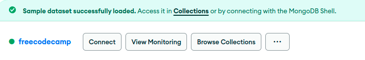

# Introduction to the MongoDB and Mongoose Challenges
Link: [https://www.freecodecamp.org/learn/back-end-development-and-apis/mongodb-and-mongoose/](https://www.freecodecamp.org/learn/back-end-development-and-apis/mongodb-and-mongoose/)
  
**MongoDB** is a database that stores data records (documents) for use by an application. Mongo is a non-relational, "NoSQL" database. This means Mongo stores all associated data within one record, instead of storing it across many preset tables as in a SQL database. Some benefits of this storage model are:
- Scalability: by default, non-relational databases are split (or "shared") across many
systems instead of only one. This makes it easier to improve performance at a lower cost.
- Flexibility: new datasets and properties can be added to a document without the need to make a new table for that data.
- Replication: copies of the database run in parallel so if one goes down, one of the copies becomes the new primary data source.

### MongoDB Setup using a Free Host
**MongoDB** Atlas is a MongoDB Database-as-a-Service platform, which essentially means that they configure and host the database for you. This makes your only responsibility to populate the database with what matters: data!

1. To get started, go to  [MongoDB Atlas](https://www.mongodb.com/products/platform/atlas-database), and **Sign in** or **Register** for new account.
2. Create a Free Shared Cluster and name your cluster **freecodecamp**.
3. Go to **Database Access**, click **ADD NEW DATABASE USER**. Create a new user with a password (make sure to copy and store this somewhere) and grant the user **Read and write to any database privileges**. Click the **Add User** button.
4. Go to **Database**, click **Browse Collections**, and then click **Create Database**. Enter a database name and collection name, then click **Create**.
5. Go to **Network Access**, click **Add IP Address**:
   - select **Allow Access from Anywhere**
   - add **Access List Entry**: **0.0.0.0/0**
6. To connect to MongoDB, go to **Database**.    
   
       
    Click **Connect**, then **Connect to your application**, and follow the steps for **Connecting with MongoDB Driver**.

